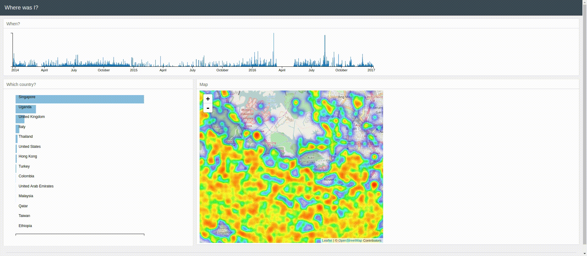

## Map your Google Location History

A simple python web app to visualise your Google location history. Similar to [Google Map's Timeline](https://www.google.com/maps/timeline) but gives a prettier and more comprehensive picture.



## How to run

1. Install all Python dependencies.
2. Download your Location History data from [Google Takeout](https://takeout.google.com/settings/takeout).
3. Save ```LocationHistory.json``` in the ```input``` folder.
4. From the input folder, run ```python sample_location.py```. This matches points to countries and
samples the data to reduce the file size. This may take a few minutes.
5. From the root folder, run ```python app.py```.

## Frameworks and Libraries

You need the following framework and libraries:

- **Framework**: 
- **Python Libraries**:
  - Pandas
  - Shapely
- **Frontend**:
  - 

